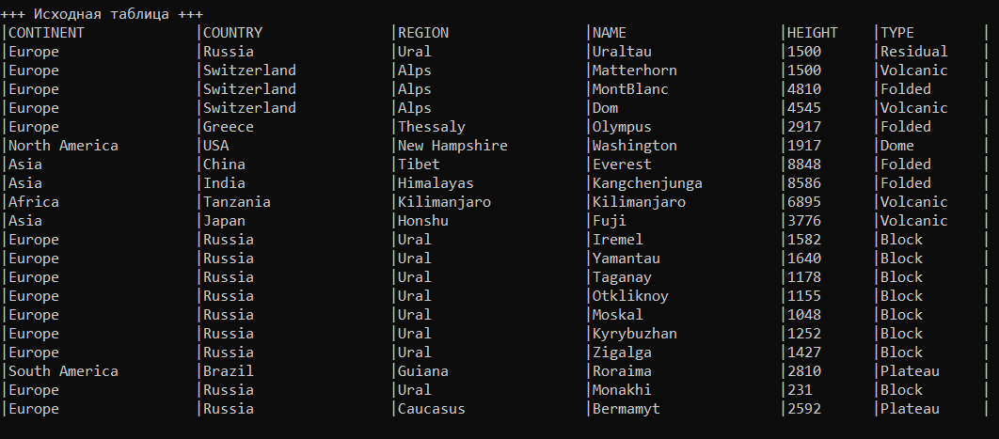
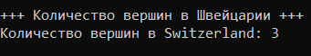
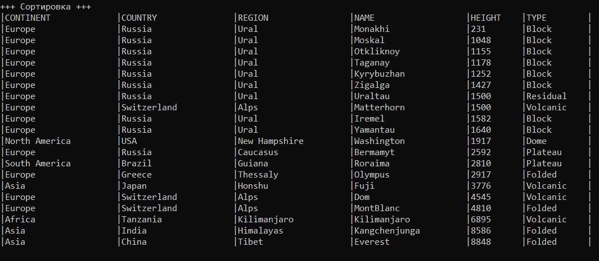
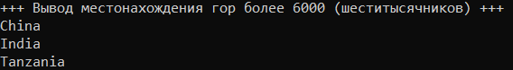
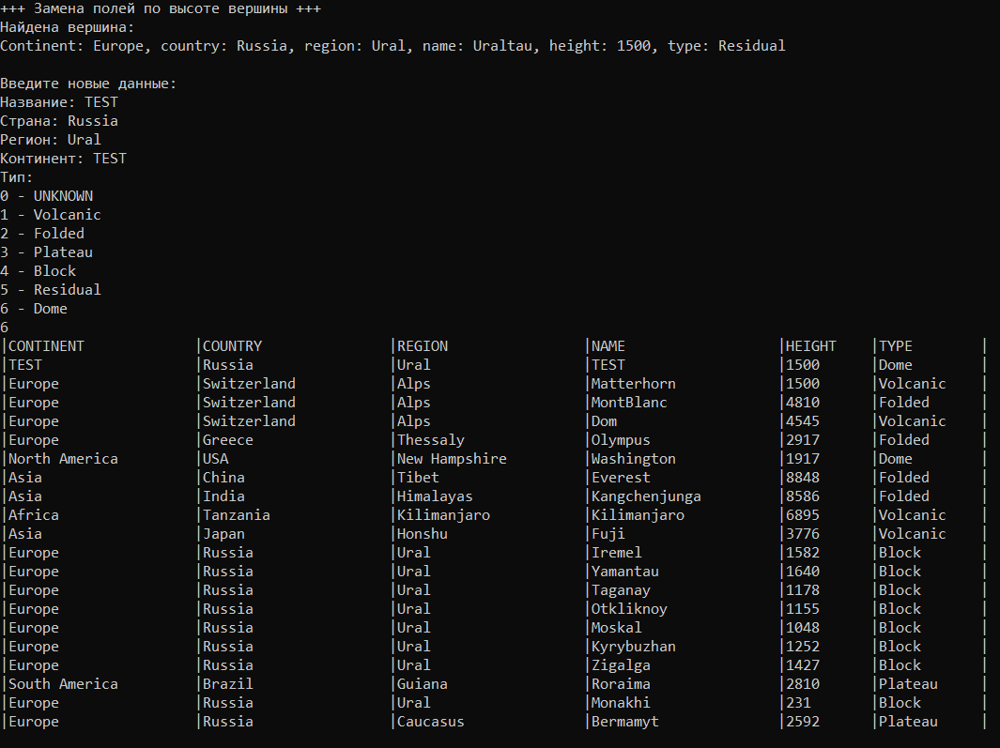
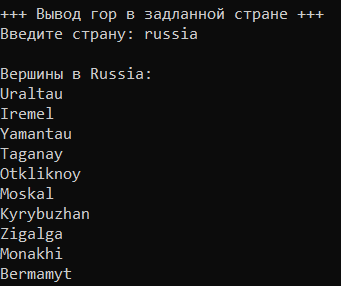
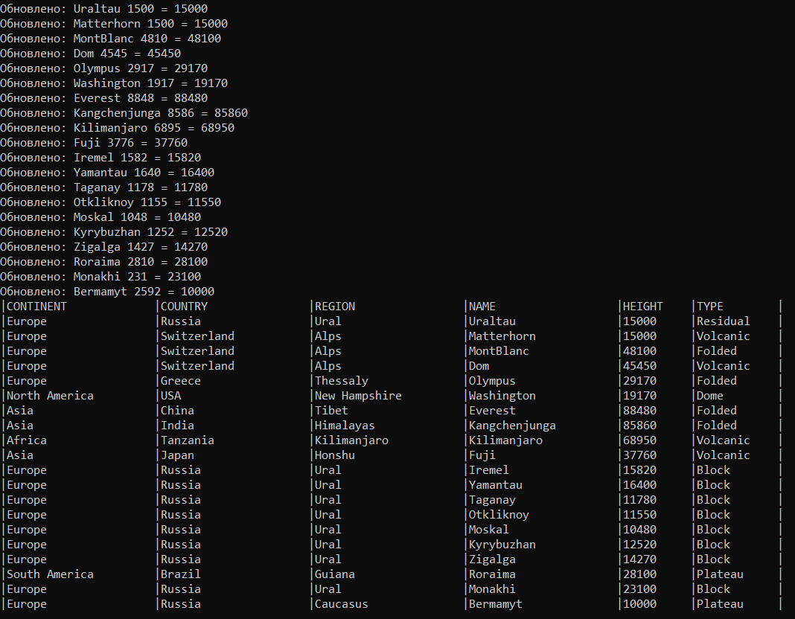

# Educational Project CPP EX09+EX10

**ET-113, Институт естественных и точных наук, ЮУрГУ**  
*Автор: Степаненко А.М.*

**Компиляция:** `make run`

---

## Исходная структура
| После запуска отображается полный список гор в табличном формате.


## Поиск данных по стране (выведена Швейцария)
| Выводится количество вершин в заданной стране


## Сортировка пузырьком

## Поиск гор по высоте (выведены горы шеститысячники)
| Отображаются только вершины выше 6000 м.


## Замена записи, если совпала высота
| При совпадении высоты (например, 1500 м) предлагается ввести новые данные.


## Поиск гор в стране

## Обновление данных из файла
| Программа читает mountains.txt и обновляет высоты вершин, названия которых совпадают.



Функция
``` C++
void save_to_file(mountain*, string = "mount_save.txt");
```
позволяет сохранить информацию из структуры в отдельный файл.

## Файл сохранения (Стандартный: mount_save.txt)
Поля разделены символом табуляции (\t):
``` SQL
Europe  Switzerland Alps    Matterhorn  1500    1
Asia    China       Tibet   Everest     8848    2
```
## Файл обновления (Стандартный: mountains.txt)
Каждая строка содержит два значения, разделённых пробелом: <название> <новая_высота>
``` SQL
Uraltau     15000
Matterhorn  15000
```